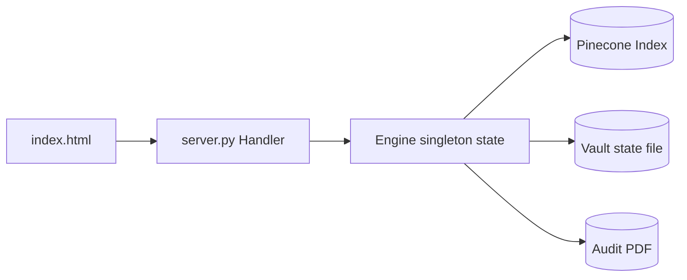
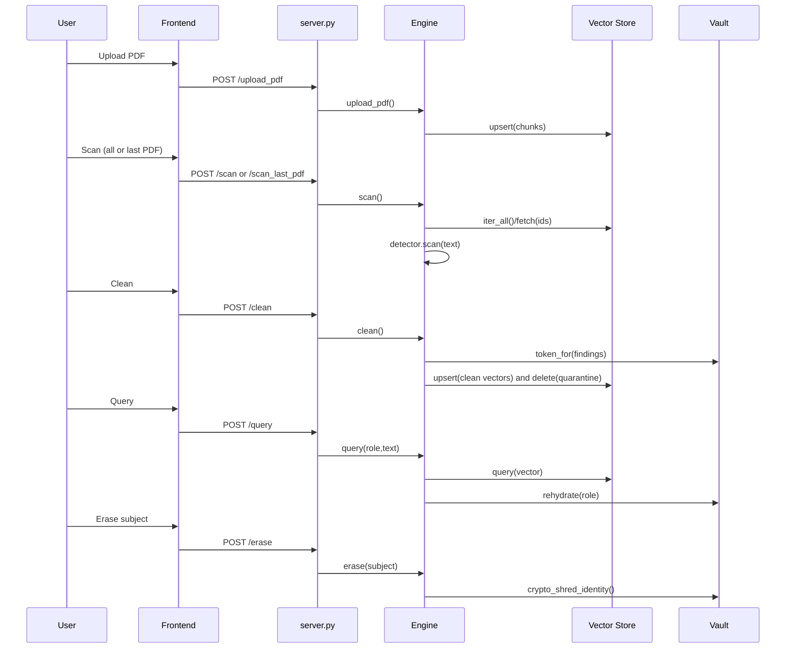
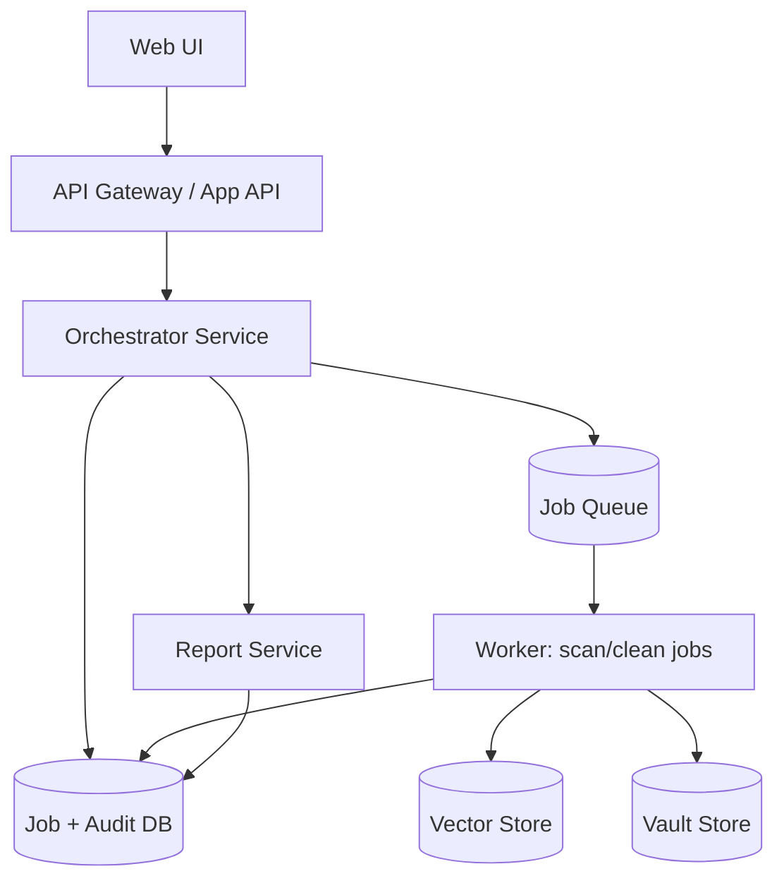

# AAGCP-Vector Architecture and Process Flow

## 1. Current Architecture (As Implemented)

The app is currently a single-process service:

- Frontend: [index.html](index.html)
- HTTP server + orchestration: [server.py](server.py)
- Core modules:
	- Detection: [aagcp/detect/detector.py](aagcp/detect/detector.py)
	- Scan: [aagcp/scan/scanner.py](aagcp/scan/scanner.py)
	- Migration/clean: [aagcp/migrate/migrator.py](aagcp/migrate/migrator.py)
	- Vault/tokenization: [aagcp/vault.py](aagcp/vault.py)
	- Retrieval/governance: [aagcp/retrieve/retriever.py](aagcp/retrieve/retriever.py)
	- Vector connector: [aagcp/store/connectors.py](aagcp/store/connectors.py)
	- PDF report: [aagcp/report/pdf.py](aagcp/report/pdf.py)

## 2. End-to-End User Flow

## 3. Process Stages and Contracts

1. Connect
- Endpoint: POST /connect
- Goal: bind to Pinecone and reset runtime state.

2. Ingest
- Endpoint: POST /upload_pdf
- Input: base64 PDF
- Output: chunked records upserted with source_text and metadata.

3. Scan
- Endpoints: POST /scan, POST /scan_last_pdf
- Output: total vectors, vectors_with_pii, by_type, cleanable, quarantine_only.

4. Clean
- Endpoint: POST /clean
- Behavior: tokenize PII -> embed masked text -> upsert same IDs.
- Fallback: missing source_text => quarantine/delete.

5. Governed Query
- Endpoint: POST /query
- Behavior: dense + BM25 rerank + vault token boost + role-based rehydration.

6. Erase
- Endpoint: POST /erase
- Behavior: reference-counted crypto-shred in vault.

7. Audit
- Endpoint: GET /report.pdf
- Behavior: build report from latest scan summary.

## 4. Key State Objects

Engine keeps mutable runtime state in memory:

- last_report
- _cleaned
- last_uploaded_ids
- last_uploaded_pdf_filename
- store connector
- vault object

This means operations are stateful per server process and not job-based.

## 5. Architecture Risks Found

1. Connect size parameter is effectively ignored in reset
- In [server.py](server.py), reset(seed) loops with range(1), so requested size does not drive seeded vector count.

2. Heavy blocking call during upload
- In [server.py](server.py), upload_pdf() includes sleep(10), which blocks request handling and increases latency.

3. Tight coupling to vault internals
- In [aagcp/migrate/migrator.py](aagcp/migrate/migrator.py), code writes vault._idnames directly, bypassing encapsulation.

4. State can drift across requests
- Scan/Clean/Report depend on last_report and _cleaned flags in process memory. A restart resets operational context.

5. Single binary process handles all concerns
- API, orchestration, long-running scan/clean tasks, and reporting are all synchronous in one service.

## 6. Target Production Architecture (Recommended)

Split into explicit layers:

### Service responsibilities

- API/Orchestrator
	- Validates requests
	- Creates job records
	- Returns job_id immediately

- Worker
	- Executes scan/clean asynchronously
	- Emits progress and final metrics

- Vault service/store
	- Token mint/resolve/erase APIs
	- No direct field-level internal mutation from other modules

- Report service
	- Builds report from persisted scan snapshots

## 7. Target API Flow (Job-based)

1. POST /jobs/scan -> returns job_id
2. GET /jobs/{id} -> status/progress/result
3. POST /jobs/clean -> returns job_id
4. GET /reports/{scan_id}.pdf
5. POST /erase with idempotency key

## 8. Data Model to Persist

- scan_runs(id, started_at, ended_at, store_name, detector_version, totals_json)
- scan_exposures(scan_id, vector_id, risk, findings_json)
- clean_runs(id, scan_id, reembedded, quarantined, pii_before, pii_after)
- erase_events(id, identity_id, tokens_destroyed, tokens_retained, requested_by, ts)
- jobs(id, type, status, progress, error, payload_json, result_json)

## 9. Suggested Implementation Plan

Phase 1 (stabilize current app)
1. Fix connect seed bug in reset()
2. Remove blocking sleep from upload path
3. Add explicit vault methods for identity alias registration (remove direct _idnames mutation)
4. Add consistent run IDs for scan and clean responses

Phase 2 (production hardening)
1. Add persistent job table
2. Convert scan/clean to async job execution
3. Persist reports and expose report-by-run endpoint
4. Add authn/authz and audit trail fields

Phase 3 (scale and reliability)
1. Move workers out of API process
2. Add retries + dead-letter handling for failed jobs
3. Add SLO metrics: p95 scan latency, clean throughput, query latency

## 10. Practical Flow You Can Present to Stakeholders

1. Ingest legacy vectors and uploaded PDFs
2. Run uncapped scan to inventory PII exposure
3. Clean only affected vectors in place (no full reindex)
4. Keep retrieval quality with governed rehydration
5. Execute subject erasure by crypto-shredding vault mappings
6. Generate regulator-ready audit reports from run snapshots

